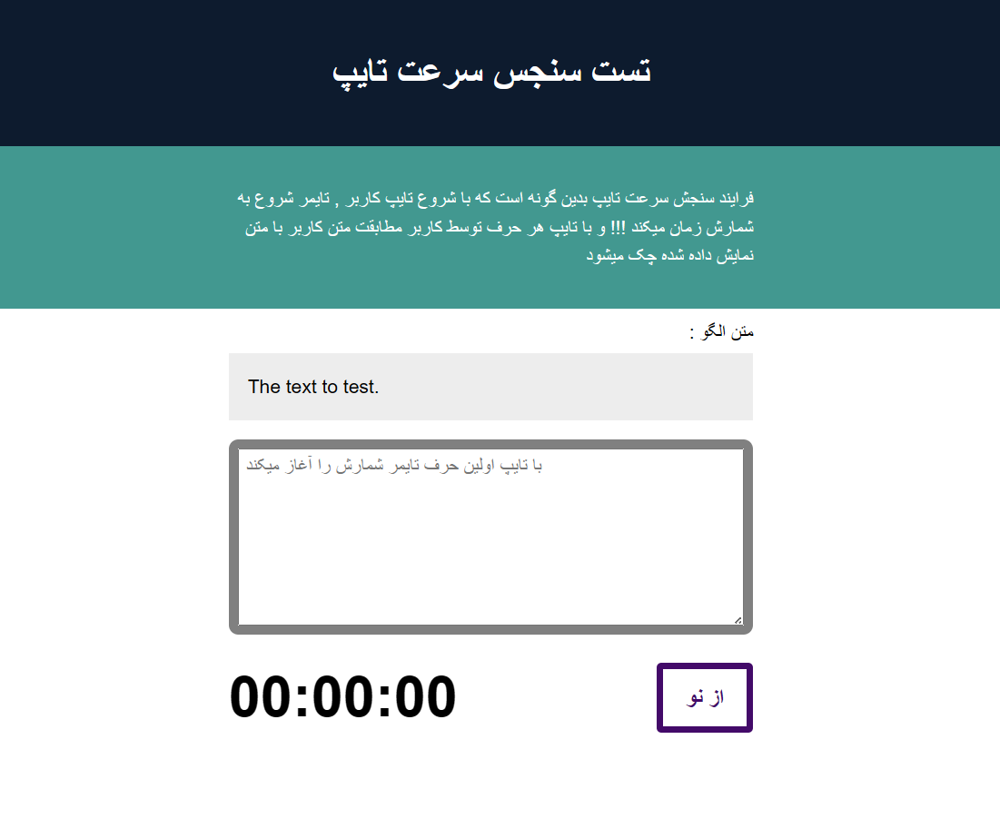

# 🖊️ Type Speed Test

A simple **Type Speed Test** game built with HTML, CSS, and JavaScript. Test how fast you can type and challenge yourself!  

🔗 **Try it live:** [Type Speed Test](https://benyamin012.github.io/Type-Speed/)

---

## 🚀 Features

- Measure your typing speed in **words per minute (WPM)**.  
- Simple, clean, and fast interface.  
- Works perfectly on **mobile** and **desktop**.  
- Fun challenge for improving typing skills.  

---

## 📸 Screenshot

Add your awesome screenshot here!  

> Tip: Take a cool screenshot while playing to showcase your score!  

---

## 🛠️ How to Use

1. Open the project in your browser or on your phone.  
2. Start typing the text that appears.  
3. See your typing speed in real-time!  

---

## 💻 Technologies Used

- HTML5  
- CSS3  
- JavaScript  

---

## ⭐ Contribution

Feel free to fork the project, make it better, and send a pull request!  

---

## 📝 License

This project is **open-source** and free to use.  

